# MRMS - Marathon Registration Management System

마라톤 대회 참가 접수 및 관리를 위한 Ruby on Rails 웹 애플리케이션입니다.

## AI Workflow



## 주요 기능

### 참가자

- 대회 코스 선택 및 참가 접수
- 고유 확인 코드(8자리 영숫자) 발급
- 확인 코드 + 이름으로 접수 내역 조회
- 마감 전 접수 취소

### 관리자

- 환경변수 기반 인증 (로그인/로그아웃)
- 대시보드에서 코스별 접수 현황 확인
- 접수 마감일 및 코스 정원 관리
- 접수 목록 정렬(날짜, 이름) 및 필터링(코스, 상태)
- Excel(.xlsx) 내보내기

### 데이터 무결성

- 동일인 중복 접수 방지 (DB unique index + 모델 검증)
- 정원 초과 방지 (Row lock + 트랜잭션)
- 마감 시간 기반 접수 차단
- 멱등성 보장 취소 처리

## 기술 스택

| 구분 | 기술 | 버전 |
|------|------|------|
| Framework | Ruby on Rails | 8.1.3 |
| Language | Ruby | 3.4.7 |
| Database | SQLite (WAL mode) | - |
| Frontend | Hotwire (Turbo + Stimulus) | - |
| CSS | Tailwind CSS | - |
| Testing | Minitest + Fixtures | - |
| Deployment | Kamal + Docker | - |
| Linter | RuboCop (Omakase) | - |

## 데이터 모델

```
Race (대회)
├── has_many :courses (코스)
│   └── has_many :registrations (접수)
└── has_many :registrations (접수)
```

| 모델 | 주요 필드 | 역할 |
|------|-----------|------|
| Race | name, event_date, location, registration_deadline | 대회 정보, 마감 관리 |
| Course | name, capacity, fee, start_time | 코스별 정원/요금 |
| Registration | name, birth_date, gender, phone_number, address, confirmation_code, status | 참가 접수 정보 |

## 시작하기

### 사전 요구사항

- Ruby 3.4.7
- Bundler

### 설치

```bash
git clone git@github.com:iamodh/mrms.git
cd mrms

bundle install

bin/rails db:create db:migrate db:seed
```

### 환경변수 설정

프로젝트 루트에 `.env` 파일을 생성합니다:

```
ADMIN_ID=admin
ADMIN_PW=password
```

### 실행

```bash
bin/dev
```

`http://localhost:3000`에서 접속할 수 있습니다.

관리자 페이지는 `http://localhost:3000/admin`에서 `.env`에 설정한 ID/PW로 로그인합니다.

### 테스트

```bash
bundle exec rails test      # 전체 테스트
bundle exec rubocop         # 코드 스타일 검사
bundle exec brakeman -q     # 보안 취약점 검사
bundle audit check --update # Gem 취약점 검사
```

## 프로젝트 구조

```
app/
├── controllers/
│   ├── home_controller.rb           # 메인 페이지 (대회 정보 + 코스 목록)
│   ├── registrations_controller.rb  # 참가 접수 (new, create, show)
│   ├── lookup_controller.rb         # 접수 조회/취소 (new, create, cancel)
│   └── admin/
│       ├── base_controller.rb       # 인증 가드
│       ├── sessions_controller.rb   # 로그인/로그아웃
│       ├── dashboard_controller.rb  # 대시보드
│       ├── registrations_controller.rb # 접수 목록/필터/엑셀 내보내기
│       ├── races_controller.rb      # 대회 정보 수정
│       └── courses_controller.rb    # 코스 정원 수정
├── models/
│   ├── race.rb                      # 대회 (마감 판단, 최신 대회 조회)
│   ├── course.rb                    # 코스 (정원 관리, 트랜잭션 접수)
│   └── registration.rb             # 접수 (입력 정규화, 상태 관리)
└── views/
    ├── home/                        # 메인 페이지
    ├── registrations/               # 접수 폼, 완료 페이지
    ├── lookup/                      # 조회/취소 페이지
    └── admin/                       # 관리자 페이지
```

## 배포

Kamal + Docker를 사용하여 Hetzner VPS에 배포합니다.

```
[브라우저] → :80/:443 → [kamal-proxy] → :3000 → [Rails + Puma]
                                                       ↕
                                              [SQLite on volume]
```

- **kamal-proxy**: 리버스 프록시, SSL 처리, 무중단 배포
- **Rails 컨테이너**: Puma 위에서 앱 실행
- **SQLite**: Docker volume mount로 데이터 영속화 (`/data/mrms/db/`)

### 배포 명령어

```bash
kamal setup    # 최초 배포
kamal deploy   # 이후 배포
```

### 프로덕션 환경변수

`.kamal/secrets`에서 관리:

- `SECRET_KEY_BASE` - 세션 암호화 키
- `ADMIN_ID` - 관리자 아이디
- `ADMIN_PW` - 관리자 비밀번호

## 개발 노트

- [동시성 환경에서의 데이터 무결성 보장](.claude/notes/concurrency-and-integrity.md)
- [배포 아키텍쳐](.claude/notes/deployment-architecture.md)
- [취소의 멱등성 설계](.claude/notes/idempotency.md)
- [if/else vs rescue: 에러 처리 방식 선택 기준](.claude/notes/if-else-vs-rescue.md)
- [Rails normalizes vs before_validation](.claude/notes/normalizes-vs-before-validation.md)
- [render vs redirect: 에러 전달 방식의 차이](.claude/notes/render-vs-redirect.md)
- [사용자 입력 기반 정렬의 SQL Injection 방지](.claude/notes/sql-injection-prevention.md)
- [Turbo Drive와 POST → render 충돌](.claude/notes/turbo-post-render.md)

### 의사결정 기록 (ADR)

- [SQLite 선택](.claude/notes/decisions/001-sqlite.md)
- [Hetzner Cloud + Kamal 선택](.claude/notes/decisions/002-hetzner.md)

## 라이선스

MIT
